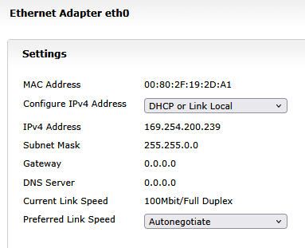
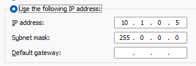

# Network

We use the [WPILib static addressing scheme.](https://docs.wpilib.org/en/stable/docs/networking/networking-introduction/ip-configurations.html#static-configuration)

* VH-109 Robot Radio: `10.1.0.1` 
* RoboRIO: `10.1.0.2`
* VH-109 Field Radio: `10.1.0.4` 
* Driver Station: `10.1.0.5`
* Team 100 Cameras: `10.1.0.30` to `10.1.0.36`
* FMS: `10.0.100.2`

All the hosts are on the same /24 segment except the FMS,
so all hosts can use the /24 mask, `255.255.255.0`,
except for the Driver Station, which needs a /8 mask,
`255.0.0.0`, so that it can reach the FMS.

## Using USB

The USB port is just a network adapter with a fixed IP.
It makes the RoboRIO address `172.22.11.2` and the driver
station `172.22.11.1`

## Static Windows IP

Make sure the IPv4 configuration is "Manual," not "Automatic".  This is the bad configuration ("DHCP" is bad):

Change the configuration to "static" and fill
in the correct IP address, `10.1.0.5` and
mask `255.0.0.0`:

## Impersonating the RoboRIO

Sometimes you want to connect to one of our
Raspberry Pi cameras without involving the
RoboRIO at all.  In this case, you change
the Windows network adapter IP address.

Change the configuration to "static" and fill
in the correct IP address, `10.1.0.2` and
mask `255.0.0.0`.

## Troubleshooting

If this doesn't work, the roborio could be using the
[link-local fallback
address](https://docs.wpilib.org/en/stable/docs/networking/networking-introduction/networking-basics.html),
which is something in the `169.254.0.0` network. `169.254.x.y`

If this happens, the roborio is probably set up wrong,
for example, it might not have a team number configured.

Try connecting to it at [roboRIO-100-FRC.local](http://roborio-100-frc.local)

## Reference

* [my cd thread](https://www.chiefdelphi.com/t/default-gateway/522496)
