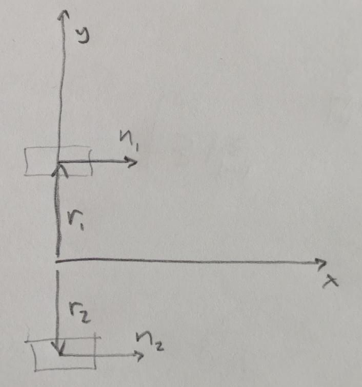

# Differential Dynamics

The dynamics of a differential drivetrain, aka "Tank Drive."




Divide the problem into two pieces.

* Determine the total rigid-body forces and torques for the desired rigid-body accelerations, using $F=ma$ and $\tau=I\alpha$.
* Find the set of drive forces that sum to the total.

The general way to handle this situation is with the concept
of a "wrench", which represents both linear and rotational
forces on the rigid body (like a twist but for force and torque).
It can be written with generality as the stacked vector:

```math
\bold{w}
=
\begin{bmatrix}
\bold{f} \\
\boldsymbol{\tau}
\end{bmatrix}
```

where $\bold{f}$ is the total force vector
and $\boldsymbol{\tau}$ the total torque
around the center of mass:


In SE2 it is three dimensional:

```math
\bold{w}
=
\begin{bmatrix}
f_x \\
f_y \\
\tau
\end{bmatrix}
```

Each component actuator (wheel) produces a
linear force $\bold{f_i}$
acting at a point $\bold{r_i}$,
which yields a wrench $\bold{w_i}$:

```math
\bold{w_i}
=
\begin{bmatrix}
\bold{f_i} \\
\bold{r_i} \times \bold{f_i}
\end{bmatrix}
```

Our problem involves a key constraint, which is that the
actuation vector directions are fixed by the drive geometry:
the vectors $\bold{n_i}$ in the diagram above.

So the component wrenches can be written:

```math
\bold{w_i}
=
\begin{bmatrix}
\bold{n_i} \\
\bold{r_i} \times \bold{n_i}
\end{bmatrix}
f_i
```
So the sum can be written:

```math
\begin{bmatrix}
f_x \\
f_y \\
\tau
\end{bmatrix}
=
\begin{bmatrix}
\bold{n_1} && \bold{n_2} && \dots && \bold{n_k} \\
\bold{r_1} \times \bold{n_1} && \bold{r_2} \times \bold{n_2} &&\dots && \bold{r_k} \times \bold{n_k}
\end{bmatrix}
\begin{bmatrix}
f_1 \\
f_2 \\
\vdots \\
f_k
\end{bmatrix}
```

Our setup is in two dimensions, so instead of the cross product,
we use the two-dimensional equivalent, the vector determinant:

```math
det(a,b) = a_x b_y - a_y b_x
```

thus:

```math
\begin{bmatrix}
f_x \\
f_y \\
\tau
\end{bmatrix}
=
\begin{bmatrix}
n_{1x} && n_{2x}  \\
n_{y1} && n_{2y}  \\
r_{1x}n_{1y} - r_{1y}n_{1x} && r_{2x}n_{2y} - r_{2y}n_{2x} 
\end{bmatrix}
\begin{bmatrix}
f_1 \\
f_2 \\
\end{bmatrix}
```

The contacts and normals from the diagram are:

```math
\bold{r_1}
=
\begin{bmatrix}
0 \\
1
\end{bmatrix}
```

```math
\bold{r_2}
=
\begin{bmatrix}
0 \\
-1
\end{bmatrix}
```

```math
\bold{n_1}
=
\bold{n_2}
=
\begin{bmatrix}
1 \\
0
\end{bmatrix}
```

So the forward dynamics are:


```math
\begin{bmatrix}
f_x \\
f_y \\
\tau
\end{bmatrix}
=
\begin{bmatrix}
1 && 1  \\
0 && 0  \\
-1 && 1 
\end{bmatrix}
\begin{bmatrix}
f_1 \\
f_2 \\
\end{bmatrix}
```

Using the
[Moore-Penrose pseudoinverse](https://en.wikipedia.org/wiki/Moore%E2%80%93Penrose_inverse),
we obtain the inverse dynamics:

```math
\begin{bmatrix}
f_1 \\
f_2 \\
\end{bmatrix}

=
\begin{bmatrix}
0.5 && 0 && -0.5  \\
0.5 && 0 && 0.5  
\end{bmatrix}

\begin{bmatrix}
f_x \\
f_y \\
\tau
\end{bmatrix}

```

Which is the familiar result.