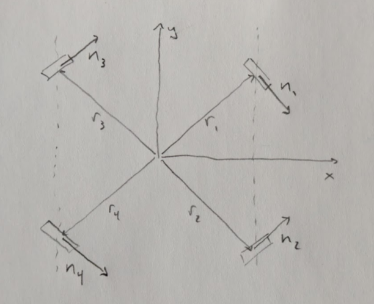
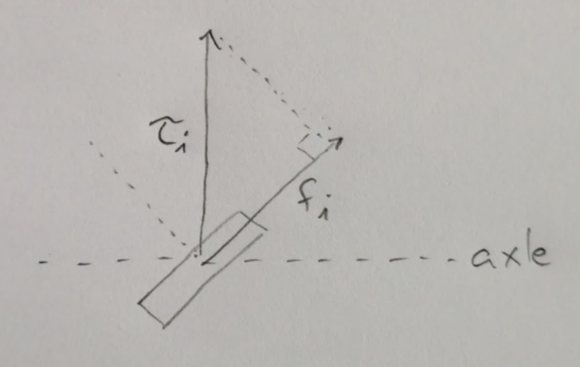

# Mecanum Drive Dynamics

The dynamics of the Mecanum drivetrain.



Divide the problem into three pieces:

* Determine the total rigid-body forces and torques for the desired rigid-body accelerations, using $F=ma$ and $\tau=I\alpha$.
* Find the set of drive forces that sum to the total.
* Project those drive forces into the wheel axes.

See [WRENCH.md](../WRENCH.md) for background.


```math
\bold{r_1}
=
\begin{bmatrix}
1 \\
1
\end{bmatrix}
```

```math
\bold{r_2}
=
\begin{bmatrix}
1 \\
-1
\end{bmatrix}
```

```math
\bold{r_3}
=
\begin{bmatrix}
-1 \\
1
\end{bmatrix}
```

```math
\bold{r_4}
=
\begin{bmatrix}
-1 \\
-1
\end{bmatrix}
```

```math
\bold{n_1}
=
\bold{n_4}
=
\begin{bmatrix}
0.71 \\
-0.71
\end{bmatrix}
```

```math
\bold{n_2}
=
\bold{n_3}
=
\begin{bmatrix}
0.71 \\
0.71
\end{bmatrix}
```

So the forward dynamics are:

```math
\begin{bmatrix}
f_x \\
f_y \\
\tau
\end{bmatrix}
=
\begin{bmatrix}
0.71 && 0.71 && 0.71 && 0.71 \\
-0.71 && 0.71 && 0.71 && -0.71 \\
-1.41 && 1.41 && -1.41 && 1.41
\end{bmatrix}
\begin{bmatrix}
f_1 \\
f_2 \\
f_3 \\
f_4
\end{bmatrix}
```

Using the
[Moore-Penrose pseudoinverse](https://en.wikipedia.org/wiki/Moore%E2%80%93Penrose_inverse),
we obtain the inverse dynamics:

```math
\begin{bmatrix}
f_1 \\
f_2 \\
f_3 \\
f_4
\end{bmatrix}
=
\begin{bmatrix}
0.35 && -0.35 && -0.18  \\
0.35 && 0.35 && 0.18 \\
0.35 && 0.35 && -0.18 \\
0.35 && -0.35 && 0.18
\end{bmatrix}
\begin{bmatrix}
f_x \\
f_y \\
\tau
\end{bmatrix}
```

From these point forces, we need to determine the wheel forces,
which are just projections in 45 degrees:



which is just multiplication by $\sqrt{2}$, yielding some
pleasantly round numbers:

```math
\begin{bmatrix}
f_1 \\
f_2 \\
f_3 \\
f_4
\end{bmatrix}
=
\begin{bmatrix}
0.5 && -0.5 && -0.25  \\
0.5 && 0.5 && 0.25 \\
0.5 && 0.5 && -0.25 \\
0.5 && -0.5 && 0.25
\end{bmatrix}
\begin{bmatrix}
f_x \\
f_y \\
\tau
\end{bmatrix}
```