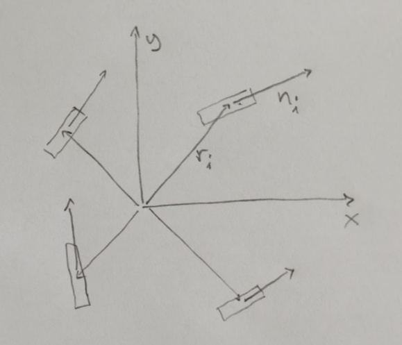

# Swerve Dynamics

Dynamics of the swerve drivetrain.



Divide the problem into three pieces:

* Determine the total rigid-body forces and torques for the desired rigid-body accelerations, using $F=ma$ and $\tau=I\alpha$.
* Find the set of drive forces (the "grasp") that sum to the total.
* Project those drive forces into the wheel axes.

See [WRENCH.md](../WRENCH.md) for background.

See [SE2](../se2/README.md) regarding the rigid-body effort.

## Contact Points

In the Swerve drive, the contact points are fixed.  For example:

```math
\mathbf{r_1}
=
\begin{bmatrix}
1 \\
1
\end{bmatrix}
\tag{1}
```

```math
\mathbf{r_2}
=
\begin{bmatrix}
1 \\
-1
\end{bmatrix}
\tag{2}
```

```math
\mathbf{r_3}
=
\begin{bmatrix}
-1 \\
1
\end{bmatrix}
\tag{3}
```

```math
\mathbf{r_4}
=
\begin{bmatrix}
-1 \\
-1
\end{bmatrix}
\tag{4}
```

## Free Actuation

In the swerve drive, the contact directions (wheel angles)
are variable, and centrifugal forces are not at all
negligible, so the only actuation case that makes sense
is the "free" case.

Also, we should model the "side force" resolved by
each wheel, using the "slip angle" concept from
tire dynamics, see below.

The free dynamics relate the rigid-body wrench
$(F_x, F_y, \tau)$ to the contact forces $(f_x, f_y)$
at each corner.

```math
\begin{bmatrix}
F_x \\
F_y \\
\tau
\end{bmatrix}
=
\mathbf{G}
\begin{bmatrix}
f_{1x} \\
f_{1y} \\
f_{2x} \\
f_{2y} \\
f_{3x} \\
f_{3y} \\
f_{4x} \\
f_{4y} 
\end{bmatrix}
\tag{5}
```
where

```math
\mathbf{G}
=
\begin{bmatrix}
1 & 0 & 1 & 0 & 1 & 0 & 1 & 0 \\
0 & 1 & 0 & 1 & 0 & 1 & 0 & 1 \\
-r_{1y} & r_{1x} & -r_{2y} & r_{2x} &
-r_{3y} & r_{3x} & -r_{4y} & r_{4x} &
\end{bmatrix}
\tag{6}
```

For the example above, this is

```math
\mathbf{G}
=
\begin{bmatrix}
1 & 0 & 1 & 0 & 1 & 0 & 1 & 0 \\
0 & 1 & 0 & 1 & 0 & 1 & 0 & 1 \\
-1 & 1 & 1 & 1 & -1 & -1 & 1 & -1 
\end{bmatrix}
\tag{6}
```

and the pseudo-inverse solution is:

```math
\mathbf{G^{-1}}
=
\begin{bmatrix}
 0.25 & 0    & -0.125 \\
 0    & 0.25 &  0.125 \\
 0.25 & 0    &  0.125 \\
 0    & 0.25 &  0.125 \\
 0.25 & 0    & -0.125 \\
 0    & 0.25 & -0.125 \\
 0.25 & 0    &  0.125 \\
 0    & 0.25 & -0.125 \\
\end{bmatrix}
\tag{6}
```

This "grasp" matrix yields the same effect for forces as the
Jacobian's effect on velocities; indeed the Jacobian is the
transpose of the grasp matrix.

## Tires

The swerve kinematics assumes the tire tread is locked to the
carpet.  The "constrained" actuation analysis assumes that
force is only transmitted "longitudinally" with the tire,
as if it were an "omni" wheel. An example where this assumption
breaks down is a constant curve, where the centripetal
force has to come from *somewhere*.

In a real car, the side force is produced by tire sidewall
deflection: the tread stays put, and the sidewall acts
like a spring.  Turn the tire a bit away from the direction
of motion, and there's a bit of side force.  Turn further
away (more "side slip"), and there's more force, all the
way to the maximum force, which is usually around the same
value as the normal force (i.e. the tire coefficient of
static friction is around 1).  For some tires, the range
of "springy" response is "large" i.e. arond 10 degrees
(0.2 rad). For racing-oriented tires, the range is
narrower, only a few degrees (0.05 rad).

The same thing happens with our rigid tires and the carpet.
We haven't measured the shape of the relationship between
slip angle and side force, but it's probably pretty steep,
like the racing tire, or steeper.

To create the centripetal force required to follow a
constant curve, then, the steering needs to be offset
very slightly and very precisely from the direction of
travel.  Thus the turn is like a four-wheel "drift" along
the curve.

Too much offset and the robot will spiral
inwards.  Too little, and the robot will spiral out.  Much
too much offset will yield a sort of "hockey stop" skid,
because the force is no longer almost normal to the
velocity, so there's a significant braking component.

Today we use zero offset, and I think we don't notice the
issue because the outer feedback loop (the computer or
the human) corrects for it.

The tire force goes all the way to the maximum possible
with a very small offset, so there's never a reason to
use any more offset: it's not possible to produce
more force than that using any mechanism.

## Resolving the Component Forces

Since the range of side-slip required to produce the
maximum possible side-force is small, we can project
the required components into the wheel orientations as
determined by (velocity) kinematics.  Then, adjust
the side-slip to generate the required side-force, and
give the longitudinal force requirement to the motor.


## References

* [The Pneumatic Tire](https://www.safetyresearch.net/Library/ACS_Pneu_Tire.pdf) (very thorough analysis of tires)
* [Hindiyeh 2013](https://ddl.stanford.edu/sites/g/files/sbiybj25996/files/media/file/2013_thesis_hindiyeh_dynamics_and_control_of_drifting_in_automobiles_0.pdf) (precursor to the DeLorean work)
* [Goh 2018](https://ddl.stanford.edu/sites/g/files/sbiybj25996/files/media/file/marty_avec2018_fullpaper_0.pdf) (the DeLorean paper)