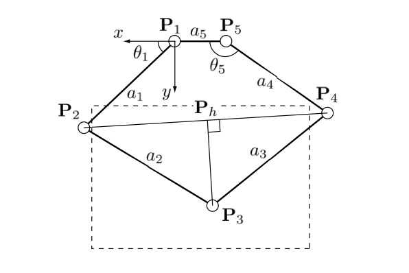
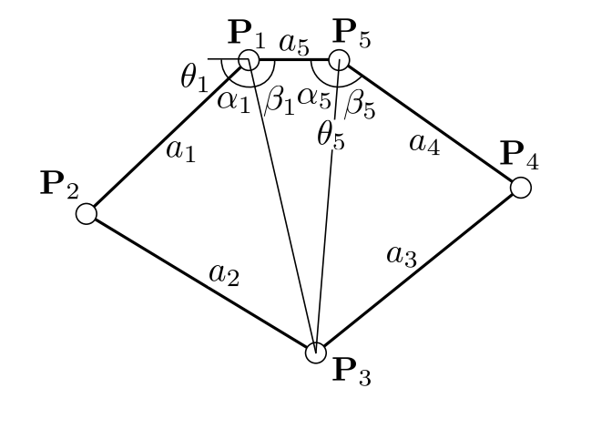

# Five-bar Kinematics

The implementation follos Campion 2005.

Using joints $P_1$,$P_2$,$P_3$,$P_4$,$P_5$, and marking the middle point $P_h$:


## Forward kinematics




```math
\|P_2-P_h\| =
\frac{(a_2^2-a_3^2+\|P_4-P_2\|^2)}{2\|P_4-P_2\|}
```
```math
P_H =
P_2 + \frac{\|P_2-P_h\|}{\|P_2-P_4\|}(P_4-P_2)
```
```math
\|P_3-P_h\| =
\sqrt{a_2^2-\|P_2-P_h\|^2}
```
```math
x_3 = 
x_h + \frac{\|P_3-P_h\|}{\|P_2-P_4\|}(y_4-y_2)
```
```math
y_3 =
y_h - \frac{\|P_3-P_h\|}{\|P_2-P_4\|}(x_4-x_2)
```

## Inverse kinematics



```math
\alpha_1 =
arccos \left(
\frac{a_1^2 - a_2^2 + \|P_1,P_3\|}{2a_1\sqrt{\|P_1,P_3\|}}
\right)
```
```math
\beta_1 = 
atan2(y_3, -x_3)
```
```math
\beta_5 =
arccos \left(
\frac{a_4^2 - a_3^2 + \|P_5,P_3\|}{2a_4\sqrt{\|P_5,P_3\|}}
\right)
```
```math
\alpha_5 = 
atan2(y_3, x_3+a_5)
```
And finally
```math
\theta_1 = \pi - \alpha_1 - \beta_1
```
```math
\theta_5 = \alpha_5 + \beta_5
```

## Jacobian

The jacobian is the rate of change of the end-effector, $(x_3,y_3)$,
with respect to the rate of change of the actuated
configuration, $(\theta_1, \theta_5)$:

```math
J =
\begin{bmatrix}
\partial x_3/\partial\theta_1 & \partial x_3/\partial\theta_5 \\
\partial y_3/\partial\theta_1 & \partial y_3/\partial\theta_5
\end{bmatrix}
```

TODO: finish this part.

## References

* [Campion 2005](https://cim.mcgill.ca/~haptic/pub/GC-QW-VH-IROS-05.pdf)
* [Khalil 2020](https://www.scribd.com/document/741490236/geomatrix-modeling-5bar-robot)