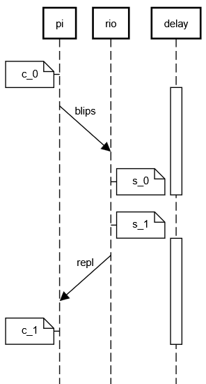

# Sync

This describes our new design for clock syncing between cameras and RoboRio.

## Original design

As originally [designed](https://github.com/wpilibsuite/allwpilib/blob/main/ntcore/doc/networktables4.adoc), the Network Tables system included
periodic timestamp synchronization using an implementation of [Cristian's_algorithm]( https://en.wikipedia.org/wiki/Cristian%27s_algorithm),
an idea so simple that it's hard to believe it has a name:

1. The client sends the current client time, $c_0$.
2. The server notes the time at receipt, $s_0$.
3. The server sends $s_0$ and $c_0$ to the client. 
4. The client notes the time at receipt, $c_1$
5. The difference is the round-trip-time (RTT):

```math
RTT = 2 * delay = c_1 - c_0
```

6. The client can surmise that $s_0$ happened exactly between $c_0$ and $c_1$.
7. In Network Tables the offset is added to the localtime to obtain the server time:

```math
s_0 = c_1 - delay + offset
```

or

```math
offset = s_0 + delay - c_1 
```

This offset was used to compute the server time for each data frame, which appears in the `timestamp` field.

```math
timestamp = clienttime + offset
```

## Revision

Immediately after release, this design caused [trouble](https://github.com/wpilibsuite/allwpilib/issues/5224), and it was [changed](https://github.com/wpilibsuite/allwpilib/commit/8b7c6852cf70d0cb9168014b68508bae77ed3fc8) from a periodic estimate to a one-shot estimate done [once at connection time](https://github.com/wpilibsuite/allwpilib/commit/8b7c6852cf70d0cb9168014b68508bae77ed3fc8#diff-2375aa79a1c18a37a91f82a9015410f427d1001400b94522fda5b4889b615493R700).  The reason given was that the variability of the measured round-trip time was sometimes high, and since the round-trip-time is simply added to the offset, and because each new packet produced a new offset, with no filtering of any kind, there was sometimes high variability in the offset.  This led to symptoms such as producing timestamps for the future.

## Problem

The main problem with the solution above is that it reduces the scope of the solution
from general clock synchronization to a single offset snapshot.  In reality, clocks
are not simply offset from each other -- they also go different speeds, resulting
in clock drift.

Because we use the Network Tables timestamp offset mechanism in the pipeline for vision,
the clock drift has been a problem.  We haven't understood it as such until now
(Feb 2026) -- in the past we attempted to simply "add magic numbers" to correct
what seemed like "extra delay".  These magic numbers have been "hard to tune"
because, of course, the correct "extra delay" depends on how long the robot has
been turned on!  It's not constant "extra delay" at all, it's
continuous drift.

Another problem with the implementation above is that it assumes the turnaround
time at the server is zero.

## Solution

IMHO the main problem with the initial design is not periodicity, it's that each
update mixed two very different quantities, and applied them as completely
authoritative.  The RTT measurement is short (milliseconds) and noisy,
varying in normal operation by a millisecond, and in abnormal operation
by tens of milliseconds.  The offset is very long (a billion seconds), and it
is not noisy at all: it varies slowly, smoothly, and consistently.  The change
in offset might be 3 ms per minute -- on the same scale as the RTT noise, but
this change in offset is meaningful to the camera pipeline.

So the solution is to model the estimated quantities more realistically:

1. Model delay correctly (see below)
2. Avoid mixing the delay measurement with the offset
3. Model the offset as slowly-varying, so noisy updates don't affect it much.

### Delay

For user code in Network Tables, delay is made up of several components:

1. Sender delay.  The time between writing a message to the buffer and when it is actually sent, a uniform distribution,  $\mathcal{U}(0, 20 ms)$
2. Network latency.  The two hosts are connected via a level-2 switch, which adds minimal delay, say 50 microseconds.
3. Latency due to Ethernet retransmits.  The backoff algorithm will add random increments of 50 microseconds in case of collision.
4. Receiver delay.  The time between the message arriving and user code reading it, $\mathcal{U}(0, 20 ms)$

The main components of delay are the two uniform distributions, which are independent,
so their sum is an [Irwin-Hall distribution](https://en.wikipedia.org/wiki/Irwin%E2%80%93Hall_distribution)
of two components, i.e. a [trianglular distribution](https://en.wikipedia.org/wiki/Triangular_distribution).
Since the components have width 20 ms, the triangle has width 40 ms: $\mathcal{T}(-20, 20, 0)$

### Measurement

We'll collect timing information a little differently,
more like the way the [Precision Time Protocol](https://en.wikipedia.org/wiki/Precision_Time_Protocol) works:

1. client sends $c_0$
2. server records $c_0$ and the receipt time, $s_0$ 
3. server sends $c_0$ and $s_0$ back to the client, with the sending time, $s_1$
4. client records $c_0$, $s_0$, $s_1$, and the receipt time, $c_1$.

We can describe the packet timings:

```math
s_0 = c_0 + offset + \mathcal{U}(0, 20)

\\[10pt]

c_1 = s_1 - offset + \mathcal{U}(0, 20)
```

So we can take the difference.  The difference of two $\mathcal{U}$ distributions yields $\mathcal{T}$ with a mean of zero:

```math
s_0 - c_1 = c_0 - s_1 + 2 * offset + \mathcal{T}(-20, 20, 0)

```

or

```math
offset = \frac{1}{2}\left( s_0 + s_1 - c_1 - c_0 \right) + + \mathcal{T}(-10, 10, 0)
```

If $s_0$ and $s_1$ are the same, this can be simplified:

```math
offset = s_0 - \frac{c_1 + c_0}{2} + \mathcal{T}(-10, 10, 0)
```
which is similar to the formulation used in Network Tables.

### Averaging

We can represent the offset as a simple average:

```math
offset(t+1) = (1-\lambda) * offset(t) + \lambda * measurement
```

So what should we choose for $\lambda$?

The steady-state error width is simply the measurement error times $\lambda$, so
if lambda is 0.1, then the steady state error is around 1 ms.

At full speed (5.0 m/s) a 1 ms error translates to a 5 mm position error, which is
acceptable.

How long does it take to converge?  If the initial offset estimate is very wrong,
say, zero, and the correct estimate is something like 2e9, then it will take
around 5 seconds to converge, which is acceptable.

[This spreadsheet](https://docs.google.com/spreadsheets/d/1Cf3FyOcmEGIvTdcXcVz9Y91zu_R-jeFPBn1eEaiUlrk/edit?gid=0#gid=0) shows these examples.

A better estimate doesn't change the convergence time very much, since the
offset is so much larger than the noise.  We could choose a larger $\lambda$ if the
measurement is *far* from the previous estimate.

### Messages

There are two messages: one from the pi to the rio ("sync1"), and
the second from the rio to the pi ("sync2").

These "messages" are really Network Tables updates, read
using `NetworkTableListenerPoller.readQueue()` 



sync1:

```
/vision/IDENTITY/sync1:
  c_0: int
```

sync2:
```
/vision/IDENTITY/sync2:
  c_0: int
  s_0: int
```

### Code

First, the python code sends sync1:

```python
@dataclass
class Sync1():
    c0: int

pub = inst.getStructTopic("/vision/IDENTITY/sync1", Sync1).publish()    
pub.set(Sync1(ntcore._now()))
```

Then, the Java code receives sync1:

```java
record Sync1(int c0){}
record Sync2(int c0, int s0){}
var sub = inst.getStructTopic<Sync1>("/vision/IDENTITY/sync1", struct).subscribe();
var pub = inst.getStructTopic<Sync2>("/vision/IDENTITY/sync2", struct).publish();

// only pick up new values
TimestampedObject<Sync1>[] queue = sub.readQueue();
int n = queue.length;
if (n > 0)
    pub.set(new Sync2(queue[n-1].value.c0(), RobotController.getFPGATime()));
```

And then the python receives sync2:

```python
sub = inst.getStructTopic("/vision/IDENTITY/sync2", Sync2).subscribe()
queue: list[TimestampedStruct] = sub.readQueue()
if queue:
    sync2: Sync2 = queue[-1]
    offset = offset(sync2.c0, sync2.s0, ntcore._now())
```

compute the measurement:

```python
def compute(c0: int s0: int c1: int) -> float:
    return s0 - (c0 + c1)/2
```

and then fuse the measurement with the average:

```python
def fuse(offset: float) -> None:
    self._measurement = self._measurement * 0.9 + offset * 0.1
```

For outgoing telemetry, we can't use the Network Tables timestamps
at all, because the publisher end expects "local" time -- there's
no simple way the explicitly provide a "server" time.
So instead, we add timestamp fields to our structs.

Because the `Struct` serialization is intended for fixed-length encoding only
(i.e. no internal arrays), we'll repeat the timestamp in each message.

```java
public class Blip24 {
    private final long timestamp;    // server timestamp, microseconds
    private final int id;            // tag id
    private final Transform3d pose;  // camera-relative tag transform
```

```python
pub = inst.getStructArrayTopic(name, Blip24).publish()
blips = [
    Blip(ntcore._now() + self._measurement, id, pose)
]
pub.set(blips)
```

## References

* https://sequencediagram.org/


```
participant pi
participant rio
participant delay


note left of pi: c_0
activate delay
pi->(4)rio:blips
note right of rio: s_0
deactivate delay
note right of rio: s_1
activate delay
pi(4)<-rio:repl
note left of pi: c_1
deactivate delay
```