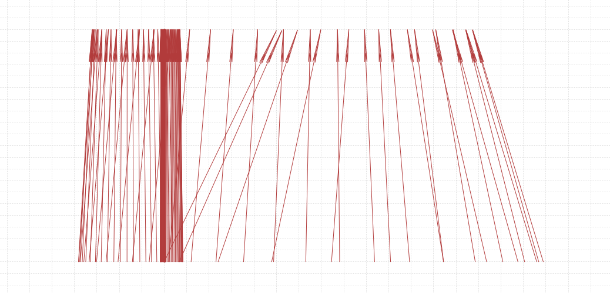
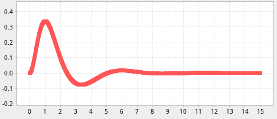
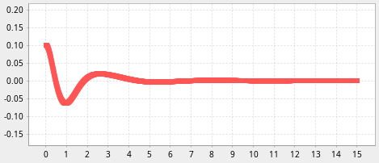

# Cart-pole in one dimension

This is a toy simulation of a common toy problem: the "cart pole."

This is a precursor to the "real" project, which is a two-dimensional cart-pole on a robot drivetrain.

## Description

There is one horizontal driven prismatic joint (the "cart"),
to which is attached a free revolute joint (the "pivot"), with a pole attached.

In one implementation, the pole is massless, with a weight on the end, and there is no friction.

In another implementation, the pole's mass is uniform along its length (so the moment of inertia is a concern),
and there is friction in both joints.

There are two equilibria for this sytem:

* bottom: a stable equilibrium below the cart, like a normal pendulum, with gravity as the restoring force.
* top: an unstable equilibrium above the cart.

There are two interesting control regimes for this system:

* swing up: starting in the "bottom" state, get the pole to the "up" state.
* stay up: if the pole is near the "top" state, keep it there.

This system has been studied by many thousands of control researchers over many decades, and it can
be controlled using a very wide variety of control strategies.

For FRC, we want to start with simple control methods.

## Swing up

A common simple "swing up" control strategy is to use the energy of the system as the controlled variable,
moving the cart to add or remove energy.  When the energy is "close" to that of the "top" state, then
control switches to the "stay up" strategy.

TODO:

* implement a "swing up" controller.

## Stay up

The `ProportionalFeedback` controller implements a very simple control law using the full state of the
system (position and velocity of both cart and pivot), with gains tuned by hand.

An interesting tidbit about this control law is that the "position" control is *positive*, i.e. the
cart goes *away* from the goal, which tips the pole the other way (towards the goal), whereupon the
(much stronger) "angle" control overcomes the position control.

Here's an example of the pole trajectory (stretched horizontally to make it easier to see):

Here's the cart displacement over time:

Here's the pivot angle over time:

TODO:

* use the position error of the top of the pole, not the cart (this reduces oscillation)
* try a cascading controller (maybe better for driving around, easier to tune?)

## Software

The code here uses the "state space representation" using a vector for the system states,
various Java generics, and general interfaces for simulation, integration, etc.  This is meant
to be a teaching tool: if it looks unfamiliar, ask about it!

## References

The form of the dynamics with friction originally came from Colin Green's work.

* https://sharpneat.sourceforge.io/research/cart-pole/cart-pole-equations.html
* https://github.com/colgreen/cartpole-physics
* https://danielpiedrahita.wordpress.com/portfolio/cart-pole-control/
* https://coneural.org/florian/papers/05_cart_pole.pdf